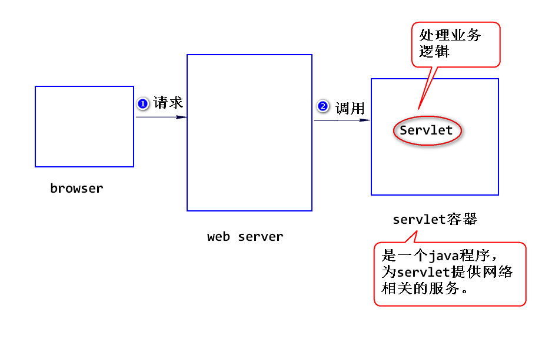
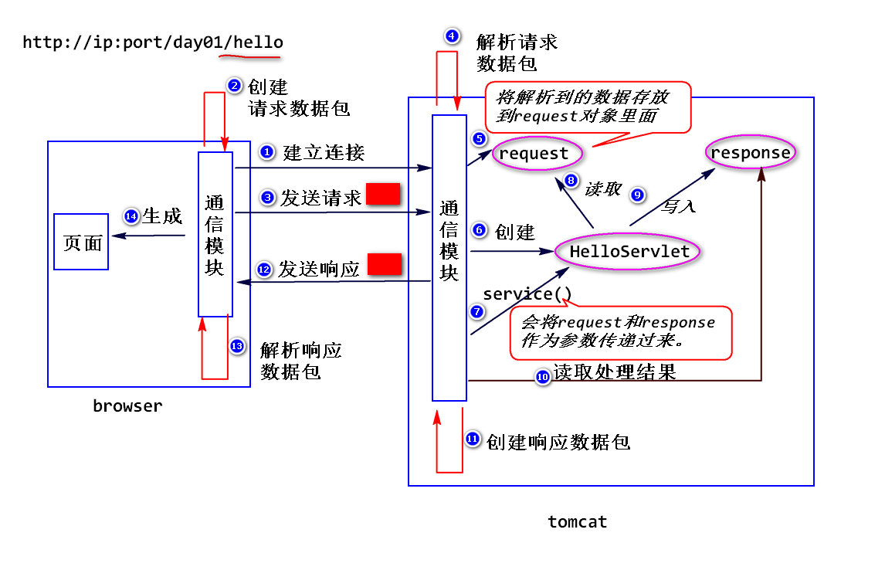
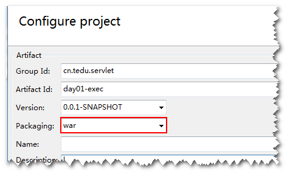
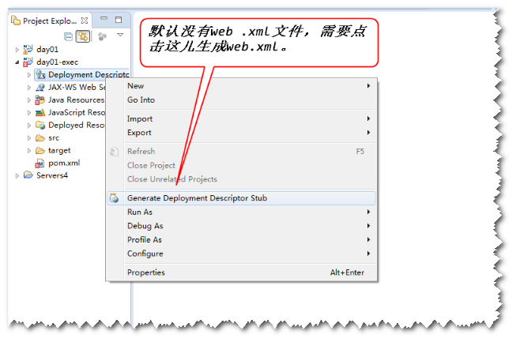
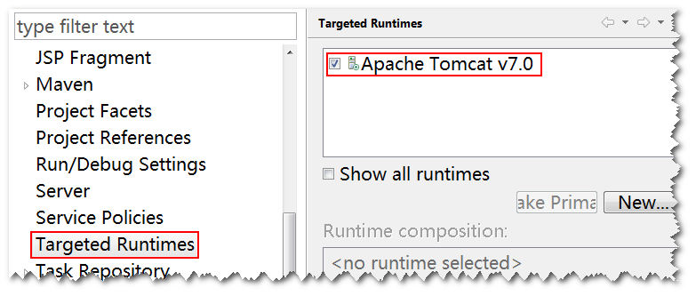

# 1.什么是Servlet?   
sun公司制定的一种用来扩展web服务器功能的组件规范。

## (1)扩展web服务器功能

	web服务器只能够处理静态资源的请求(需要事先将html文件写好)，不
	能够处理动态资源的请求(需要计算生成html),所以，需要扩展。
	可以使用Servlet来扩展web服务器功能，当web服务器收到请求之后，
	如果需要计算，则交给Servlet来处理。
	
	注：
		常见的web服务器有apache、iis、nginx等。

## (2)组件规范
1)什么是组件?

	符合规范，实现部分功能，并且需要部署到相应的容器里面才能运行的
	软件模块。
	Servlet就是一个组件，需要部署到Servlet容器里面才能运行。

2)什么是容器?
	
	符合规范，提供组件的运行环境的程序。
	Tomcat就是一个Servlet容器，为Servlet提供运行环境（提供网络
	相关的服务）。

# 2.如何写一个Servlet?
step1.写一个java类，实现Servlet接口或者继承HttpServlet类。

	注:
		通常选择继承HttpServlet类。

step2.编译。
	
step3.打包(即创建一个具有如下结构的文件夹)。

	appname (应用名)
		WEB-INF
			classes (放 .class文件) 
			lib (放 .jar文件 该文件夹可选)
			web.xml (部署描述文件)

step4. 部署。
	
	将step3创建好的整个文件夹拷贝到容器相应的位置。
		
	注：
		可以将整个文件夹使用jar命令先压缩成".war"为后缀的文件,
		然后再拷贝。

step5.启动容器，访问Servlet。

	http://ip:port/appname/url-pattern

	注:
		url-pattern在web.xml当中设置。

# 3. Servlet是如何运行的?
比如，在浏览器地址栏输入 http://ip:port/day01/hello

	step1.浏览器依据ip和port建立连接。
	step2.浏览器将相关数据放到请求数据包里面，然后发送给服务器。
	step3.服务器解析请求数据包，将解析到数据添加到request对象，
	同时，创建一个response对象。
	step4.服务器创建Servlet对象，然后调用该对象的service方法。
		
		注：
			服务器会将request和response对象作为参数传递过来，
		开发人员只需要调用这两个对象的方法就可以了，不用考虑网
		络相关的问题。
			比如，要读取请求数据包中的数据，只需要调用request
		对象的方法就可以了。类似的，要向浏览器发送处理结果，只
		需要调用response对象的方法就可以了。
	step5.服务器从response对象中获得处理结果，然后创建响应数据包并发送给浏览器。
	step6.浏览器解析响应数据包，生成相应的页面。

# 4.常见的问题
## (1)404
1)含义:服务器依据请求路径找不到对应的资源。

	注:
		404是一个状态码，状态码是一个三位数字，表示服务器
		处理请求的一种状态。

2)产生的原因:
	
	a.请求路径写错。
	要按照 http://ip:port/appname/url-pattern来写。
	
	b.应用没有部署或者部署失败。

## (2)500
1)含义: 系统出错。

2)产生的原因:
	
	a.没有严格按照规范来写代码（包括部署描述文件写错）
	
	b.代码不严谨。
		比如，对请求参数不做检查，直接做类型转换。

## (3)405
1)含义: 找不到处理方法。

2)产生的原因:
		
	没有正确override HttpServlet的service方法。
	

# 练习
写一个DateServlet，输出当前的系统日期

比如在浏览器栏输入http://ip:port/day01-exec/date，
返回 2018-09-20

## 提示:
step1.创建一个maven工程，注意要选war包。

step2.添加web.xml文件。

step3.指定服务器(在工程上点击鼠标右键，点击properties,
然后如下图进行选择)。

step4.添加DateServlet。
参考代码如下:

	public class DateServlet extends HttpServlet{
	
	public void service(
			HttpServletRequest request,
			HttpServletResponse response)
	throws ServletException,IOException{
		
		//获得系统日期
		Date date  = new Date();
		SimpleDateFormat sdf = 
				new SimpleDateFormat("yyyy-MM-dd");
		String dateStr = 
				sdf.format(date);
		
		//输出日期
		response.setContentType("text/html");
		PrintWriter out = 
				response.getWriter();
		out.println(dateStr);
		out.close();
		}
	}

step5.在部署描述文件(web.xml)中添加Servlet配置信息。
参数配置如下:

	<servlet>
 		<servlet-name>dateServlet</servlet-name>
 		<servlet-class>web.DateServlet</servlet-class>
 	</servlet>
 	<servlet-mapping>
 		<servlet-name>dateServlet</servlet-name>
 		<url-pattern>/date</url-pattern>
 	</servlet-mapping>

step6.在工程上点击鼠标右键，在弹出菜单中选Run As --> Run on Server。

	注：
		eclipse会在容器上指定的位置创建符合servlet规范的文件
		夹(默认以工程名作为应用名),并且会将.java文件编译成.class
		文件并放到classes文件夹下。也就是说eclipse会简化编译、
		打包、部署、运行的过程。

step7.在浏览器地址栏输入请求地址，访问该Servlet。

	

	

		