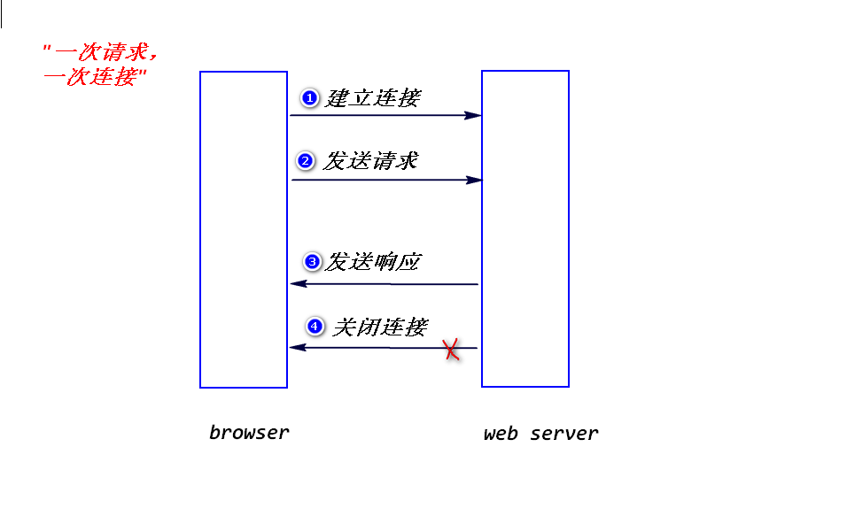
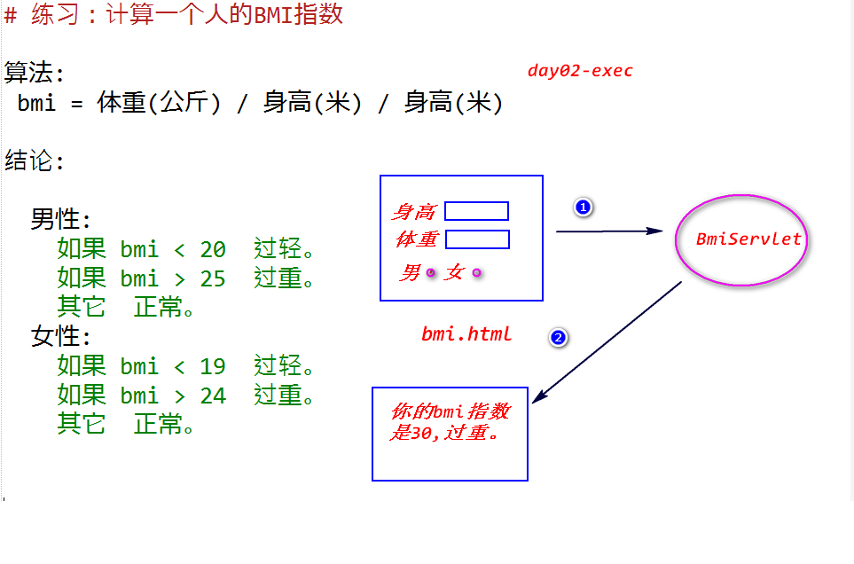
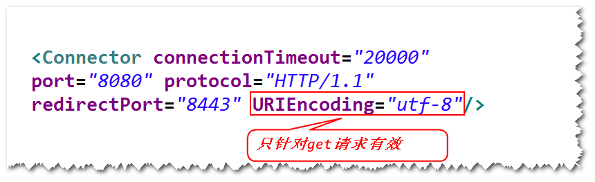
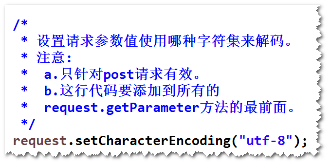
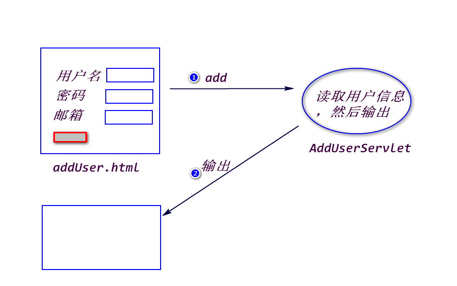

# 1.http协议 (了解)
## (1)什么是http协议?
是一种网络应用层协议，规定了浏览器与web服务器之间如何通信以及
相应的数据包的结构。

	a. tcp/ip协议：属于传递层和网络层协议，保证数据可靠的传递。
	http协议属于应用层协议，需要依赖tcp/ip协议来传递数据包。
	
	b.浏览器与web服务器之间如何通信:
		
		step1.建立连接
		step2.发送请求
		step3.发送响应
		step4.关闭连接

	c.特点:
		"一次请求，一次连接"
		这样做的好处是,服务器可以利用有限的连接为尽可能多的请求服务。

## (2)数据包的结构
1)请求数据包

	a.请求行: (请求方式 请求资源路径 协议和版本)
	b.若干消息头:
		消息头是一些键值对(使用": "分隔),浏览器与web服务器之间
		可以通过消息头来传递一些特定的信息。比如，浏览器可以通过
		发送"user-agent"消息头，告诉服务器浏览器的类型和版本。
	c.实体内容:
		只有当请求方式为post时，实体内容才会有数据。
		请求方式为get时，实体内容为空。

2)响应数据包
	
	a.状态行 (协议和版本 状态码  状态描述)
		200: 正常
		500: 系统出错
		404: 依据请求路径找不到对应的资源
	b.若干消息头
		服务器也可以发送一些消息头给浏览器，比如，可以发送
		"content-type"消息头，告诉浏览器，服务器返回的数据类型。
	c.实体内容
		程序的处理结果，浏览器会解析出来，生成相应的页面。
	
## (3)两种请求方式
1)get请求

	a.哪一些情况浏览器会发送get请求?
		在浏览器地址栏直接输入某个地址
		点击链接
		表单默认的提交方式
	b.特点
		会将请求参数添加到请求资源路径的后面，只能提交少量的数据给
		服务器。
			注：请求行只能存放大约2k左右的数据。
		会将请求参数显示在浏览器地址栏，不安全。
			注：有些网络设备，比如路由器就会记录包含了请求参数的
			请求地址。

2)post请求
	
	a.哪一些情况下，浏览器会发送post请求?
		将表单的method属性设置为"post"。
	b.特点
		会将请求参数添加到实体内容里面，可以提交大量的数据给服务器。
		不会将请求参数显示在浏览器地址栏，相对安全。
		注：
			http协议并不会对数据加密，所以，对于敏感数据
		需要进行加密处理(需要使用https协议)

# 2.Servlet输出中文，如何处理?
## (1)为什么会产生乱码?
out.println方法默认会使用"iso-8859-1"来编码(不支持中文)。

## (2)如何处理?
response.setContentType("text/html;charset=utf-8");

# 3.如何读取请求参数值?
(1)String request.getParameter(String paramName);

	注：
		a.如果请求参数名写错，获得null值。
		b.表单提交时，如果不填写任何数据，会获得""。

(2)String[] request.getParameterValues(String paramName);
	
	注：
		a.当有多个请求参数名相同时，使用此方法。
		?interest=cooking&interest=fishing
		b.对于多选框和单选框，如果一个都不选，会获得null值。

# 4.表单包含有中文参数值，如何处理?
## (1)为什么会有乱码?
当提交表单时，浏览器会按照打开该表单所在的页面时的字符集来
对中文参数值进行编码。比如，使用utf-8来编码，而服务器端默认
会使用iso-8859-1来解码。所以，会产生乱码。

## (2)如何解决?
### 1)get请求
可以修改服务器端的配置。

### 2)post请求
request.setCharacterEncoding(String charset);

	

# 练习

