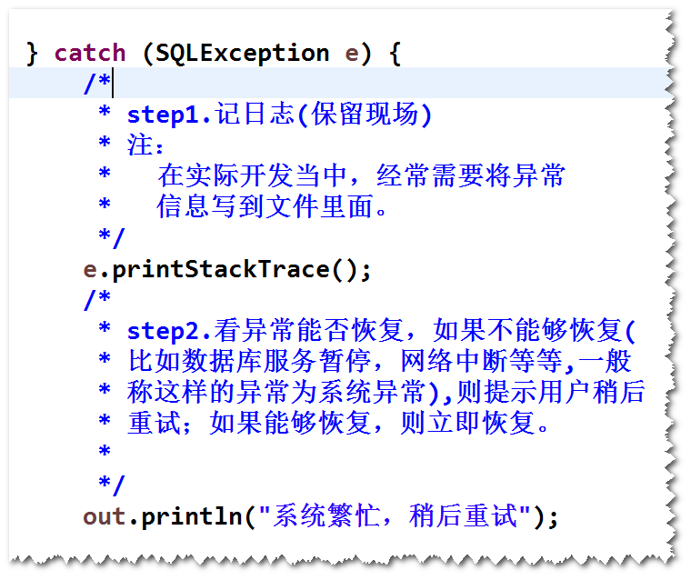

# 1.访问数据库
step1. 建表

	create table t_user(
		id int primary key auto_increment,
		username varchar(50) unique,
		password varchar(20),
		email varchar(30)
	);

step2.导包。

	<dependencies>
		<dependency>
			<groupId>mysql</groupId>
			<artifactId>mysql-connector-java</artifactId>
			<version>5.1.6</version>
		</dependency>

 	<dependency>
			<groupId>commons-dbcp</groupId>
			<artifactId>commons-dbcp</artifactId>
			<version>1.4</version>
		</dependency>
	</dependencies>

step3.将DBUtils类及jdbc.properties文件复制过来。

step4.修改AddUserServlet，使用jdbc访问数据库(注意异常的处理)。

# 2. DAO (Data Access Object) 
## (1)什么是DAO?
封装了数据访问逻辑的对象。

## (2)如何写一个DAO?
step1. 写一个java类，用于存放从数据库中查询得到的数据。
	
	public class User {
	private int id;
	private String uname;
	private String pwd;
	private String email;
	
	@Override
	public String toString() {
		return "User [id=" + id + ", uname=" + uname + ", pwd=" + pwd + ", email=" + email + "]";
	}
	
	public int getId() {
		return id;
	}
	public void setId(int id) {
		this.id = id;
	}
	...

step2. 写DAO类，该类封装了数据库访问逻辑。

	public class UserDAO {
	
	/**
	 * 将所有用户信息查询出来
	 */
	public List<User> findAll() throws SQLException{
		List<User> users = 
				new ArrayList<User>();
		
		Connection conn = null;
		PreparedStatement prep = null;
		ResultSet rs = null;
		
		try {
			conn = DBUtils.getConnection();
			String sql = "SELECT * FROM t_user";
			prep = conn.prepareStatement(sql);
			rs = prep.executeQuery();
			
			while(rs.next()){
				int id = rs.getInt("id");
				String uname = 
						rs.getString("username");
				String pwd = 
						rs.getString("password");
				String email = 
						rs.getString("email");
				
				User user = new User();
				user.setId(id);
				user.setUname(uname);
				user.setPwd(pwd);
				user.setEmail(email);
				
				users.add(user);
						
			}
			
		} catch (SQLException e) {
			e.printStackTrace();
			throw e;
		}finally{
			DBUtils.close(conn, prep, rs);
		}
		return users;
		}
	}

## (3)DAO的优点
a.方便测试

	比如，如果将数据库访问代码写在Servlet里面，需要部署应用才能
	测试。而将数据库访问代码写在DAO类里面，可以直接测试。

b.方便分工协作

	比如，一部分人专注写数据访问逻辑，一部分人专注写Servlet。

c.方便代码的维护
	
	比如，数据访问逻辑发生改变，不会影响到Servlet。

	

 

