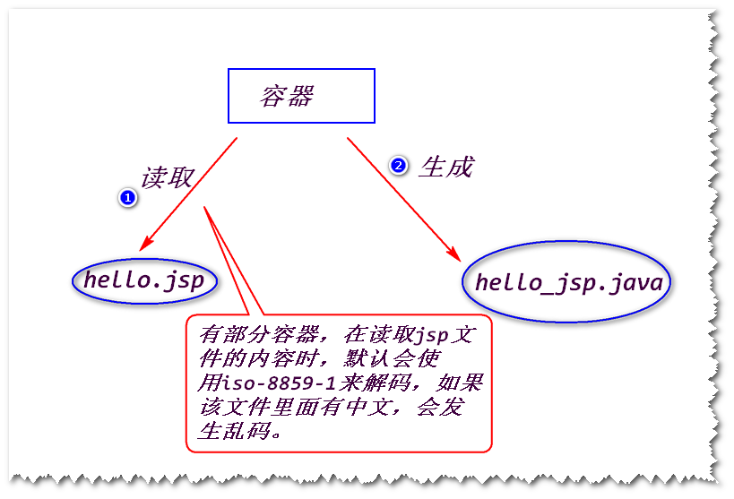

# 1.重定向
## (1)什么是重定向?
服务器通知浏览器向某个地址发送请求。

	注：
		服务器可以通过发送302状态码及Location消息头(该消息头的
		值是一个地址，一般称之为重定向地址)给浏览器，浏览器收到之后，会立即向重定向地址发送请求。

## (2)如何重定向?
response.sendRedirect(String url);

	注：
		url用来指定重定向地址。

## (3)重定向的一个细节
重定向之前，容器会先清空response对象上存放的所有数据。

	注：
		实体内容为空。

## (4)特点
a.重定向地址是任意的。

b.重定向之后，浏览器地址栏的地址会发生变化。

# 2. jsp
## (1)jsp是什么?
sun公司制订的一种服务器端的动态页面技术规范。

	注:
		因为虽然可以使用Servlet生成动态页面，但是过于繁琐
	(需要使用大量的out.println语句)，并且不好维护(修改页面，
	就必须修改java源代码),所以，sun才制订了jsp规范。
		jsp是一个以.jsp为后缀的文件(主要内容为html和少量的
	java代码)，容器会将jsp文件转换成一个对应的Servlet然后执行。
		jsp的本质就是一个Servlet!

## (2)jsp文件中可以添加哪些内容?
### 1)html(css,javascript)
直接写即可。

### 2)java代码
方式一 : java代码片断

	<%   java代码   %>

方式二 : jsp表达式

	<%= java表达式 %>

### 3)隐含对象
a.什么是隐含对象?

	直接可以使用的对象，比如out,request,response。

b.为什么可以直接使用这些隐含对象?

	容器在将jsp转换成对应的Servlet时，会自动添加获得这些
	对象的代码。

### 4)指令
a.什么是指令?

	通过指令，可以告诉容器在将jsp转换成Servlet时做一些额外的处理，
	比如导包。

b.语法

	<%@ 指令名 属性=值  %>
	注：
		如果有多个属性，使用空格隔开。

c.page指令
	
	import属性：指定要导入的包名，比如
	<%@ page import="java.util.*,java.text.*" %>
	注:
		如果要导多个包，使用","隔开。
	contentType属性: 设置response.setContentType方法的参数值。
	pageEncoding属性：告诉容器，在读取jsp文件的内容时，使用
				该属性指定的字符集去解码。

## (3)jsp是如何执行的?
### 1)阶段一　容器先将jsp转换成一个对应的Servlet

	html(css,javascript) -----> 在service方法里面，使用									out.write输出。
	<%     %>            -----> 在service方法里面，照搬。
	<%=    %>            -----> 在service方法里面，使用
								out.print输出。
	

### 2)阶段二　容器调用该Servlet

	需要将Servlet编译，然后实例化，调用对应的service方法。

#　练习　
写一个date.jsp,输出当前的系统日期。

http://ip:port/day04/date.jsp
2018-09-26

		

