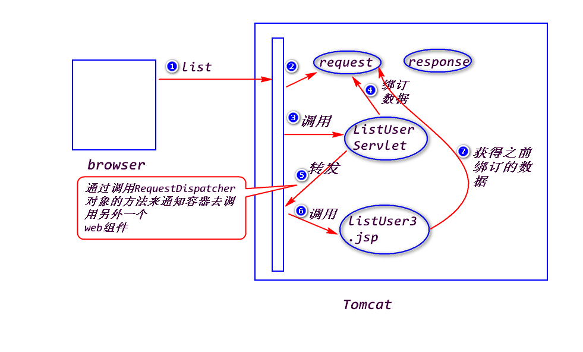
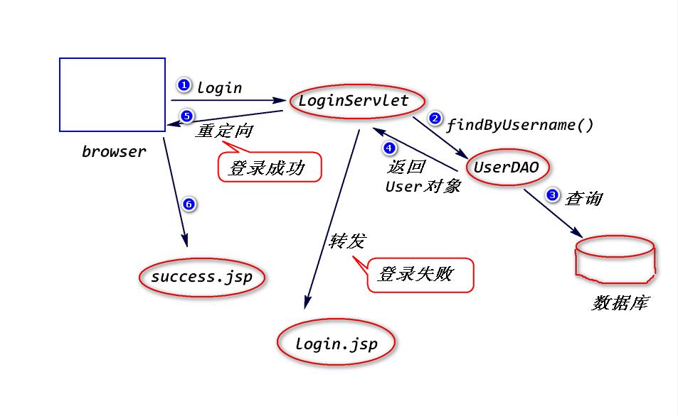

# 1.转发
## (1)什么是转发?
一个web组件将未完成的处理通过容器交给另外一个web组件继续做。

	注:
		web组件指的是servlet或者是jsp。
		通常是一个Servlet获得数据之后转发给一个jsp来展现。

## (2)如何转发?
step1.绑订数据到request对象上。
	
	request.setAttribute(String name,Object obj);
	注:
		name:绑订名
		obj:绑订值
		Object request.getAttribute(String name);

step2.获得转发器。
	
	RequestDispatcher rd = 
			request.getRequestDispatcher(String url);
	注:
		url是转发的地址。通常是一个jsp。

step3.转发

	rd.forward(request,response);

## (3)特点
a.转发的地址是有限制的，要求属于同一个web应用。

b.转发之后，浏览器地址栏的地址不变。

# 练习　登录
用户填写用户名和密码，服务器端依据用户名和密码查询数据库，
如果有匹配的记录，则登录成功，否则，登录失败(提示用户"用户名
或密码错误")。

	
	

			

		