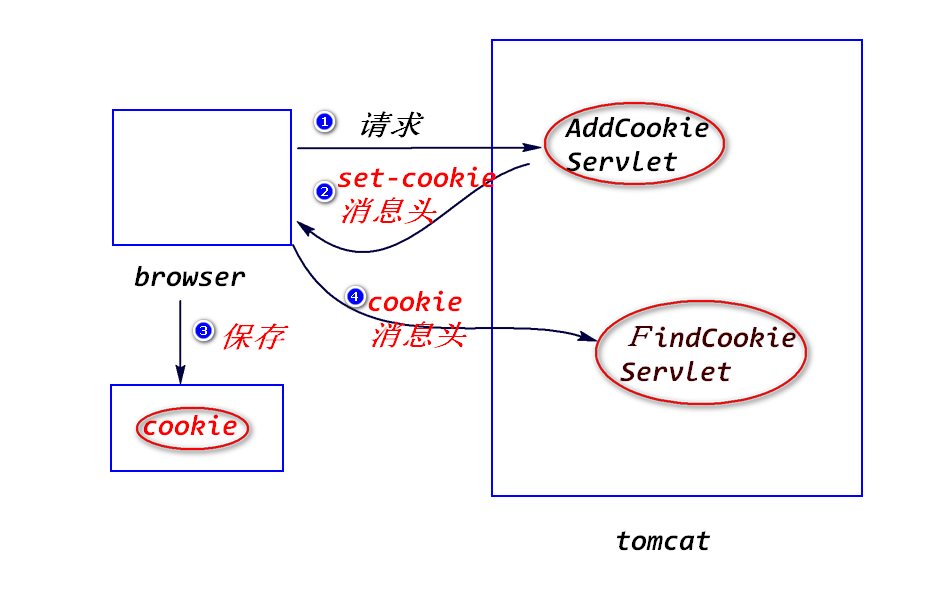
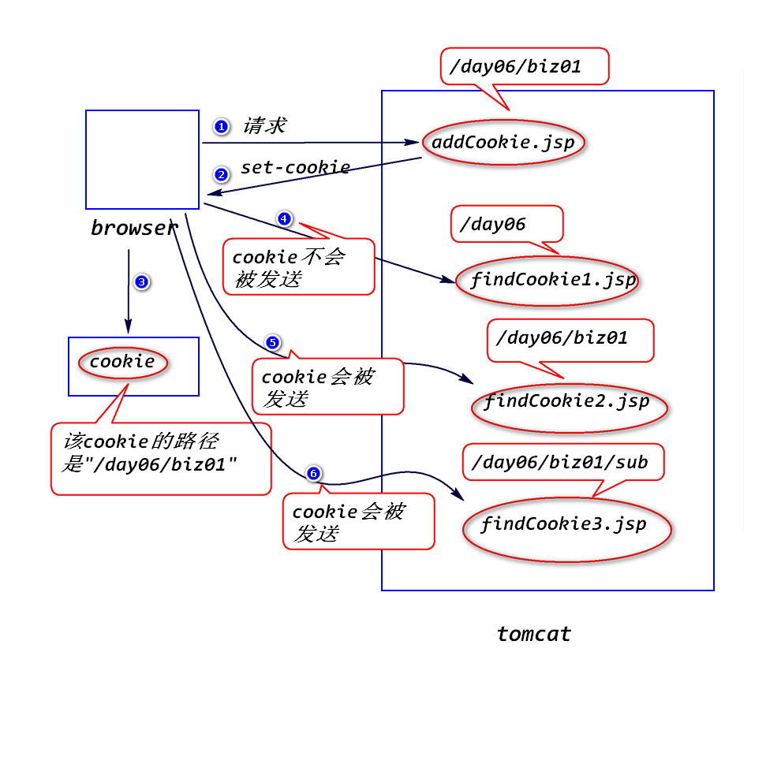
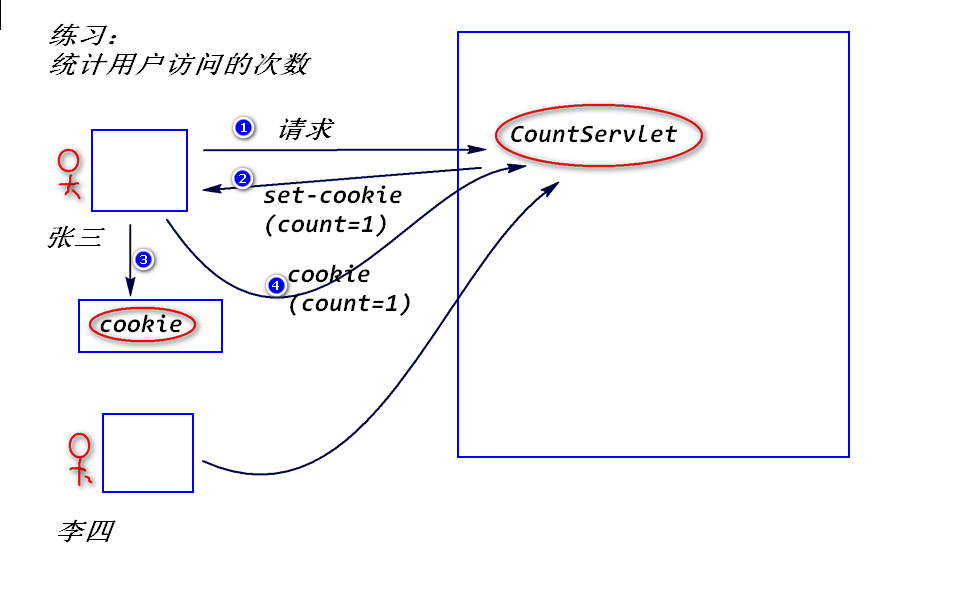

# 1.转发与重定向的区别
## (1)能否共享request对象
转发可以，而重定向不行。

	当请求到达容器，容器创建request对象和response对象，当
	响应发送完毕，容器会销毁这两个对象。也就是说，request对象
	和response对象的生存时间是一次请求和响应期间存在。

## (2)目的地是否有限制
转发有限制,重定向没有。

	转发地址要求属于同一个web应用，重定向地址是任意的。

## (3)浏览器地址栏的地址有无变化
转发没有变化，重定向有变化。

## (4)一件是否已经做完
转发是一件事没有做完，让另外一个web组件继续做；
而重定向是一件事已经完成，再做另外一件独立的事件。

# 2.状态管理
## (1)什么是状态管理?
将浏览器与web服务器之间多次交互当做一个整体来处理，并且将多次
交互所涉及的数据(即状态)保存下来。

## (2)如何进行状态管理?
a.将状态保存在浏览器端(Cookie)。

b.将状态保存在服务器端(Session)。

## (3)Cookie
### 1)什么是Cookie?
服务器临时存放在浏览器端的少量数据，用于跟踪用户的状态。

### 2)工作原理

	当浏览器访问服务器时，服务器会将少量数据以set-cookie消息头的
	方式发送给浏览器，浏览器会将这些数据临时保存下来；当浏览器再
	次访问服务器时，会将这些数据以cookie消息头的方式发送给服务器。

### 3)添加Cookie

	Cookie c = new Cookie(String name,String value);
	注：
		cookie只能存放字符串。
	response.addCookie(c);

### 4)读取Cookie
	
	Cookie[] request.getCookies();
	String cookie.getName();
	String cookie.getValue();

### 5)cookie的生存时间
默认情况下，浏览器会将cookie保存在内存里面。浏览器关闭，则cookie
会被删除。

	cookie.setMaxAge(int seconds);
	注:
		a.单位是秒。
		b.当seconds > 0时，浏览器会将cookie保存在硬盘上，当超过
			指定时间，cookie会被删除。
		c.当seconds < 0时，浏览器会将cookie保存在内存里面。
		d.当seconds = 0时，浏览器会立即删除该cookie。
			
			比如，要删除一个名称为"username"的cookie:
			Cookie c = new Cookie("username","");
			c.setMaxAge(0);
			response.addCookie(c);

### 6)cookie的编码问题
a.什么是cookie的编码问题?

	cookie只能存放合法的ascii字符，中文需要转换成合法的
	ascii字符的形式才能存放。

b.如何处理?
	
	String URLEncoder.encode(String str,String charset);
	String URLDecoder.decode(String str,String charset);

c.建议，不管是否为中文，最好统一编码处理。

### 7)cookie的路径问题
a.什么是cookie的路径问题?

	浏览器访问服务器时，会比较请求地址是否与cookie的路径匹配，
	只有匹配的cookie才会被发送。

b.cookie的默认路径
	
	cookie的默认路径等于添加该cookie的web组件的路径。
	比如 /day06/biz01/addCookie.jsp添加了一个cookie,
	则该cookie的路径就是"/day06/biz01"。

c.匹配规则

	请求路径必须等于cookie的路径或者是其子路径，只有满足该条件
	的cookie才会被发送。
	比如，cookie的路径是"/day06/biz01",则访问如下地址

		/day06/findCookie1.jsp  no
		/day06/biz01/findCookie2.jsp　yes
		/day06/biz01/sub/findCookie3.jsp　yes
	

	
d.可以修改cookie的路径

	cookie.setPath(String path);

# 练习：
写一个Servlet,该Servlet先查看有没有一个名称为"cart"的cookie,
如果有，则显示该cookie的值；如果没有，则添加该Cookie。

		Cookie c = new Cookie("cart","123");

# 练习:

				
			

 	
