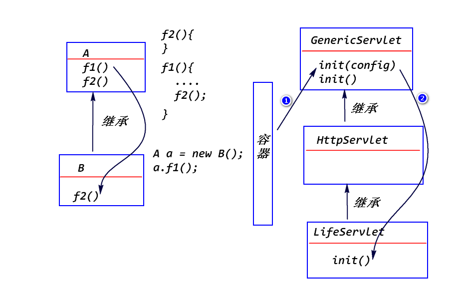

# 1.Servlet的生命周期
## (1)什么是Servlet的生命周期?
Servlet容器如何创建Servlet对象、如何对该对象进行初始化处理、
如何调用该对象的方法来处理请求、以及如何销毁该对象的整个过程。

## (2)Servlet的生命周期分成哪几个阶段?
### 1)实例化
a.什么是实例化?

	容器调用Servlet的构造器，创建Servlet对象。

b.什么时候实例化?

	情形1:　容器收到请求之后才创建相应的实例。
	情形2:  容器启动之后，立即创建相应的实例(需要额外的配置)。

c.对于某个Servlet,容器只会创建一个实例。

### 2)初始化
a.什么是初始化?

	容器调用servlet对象的init(ServletConfig config)方法。
	注:
		init方法只会调用一次！

b.GenericServlet已经提供了init方法的实现。
	
	会将容器传递过来的ServletConfig对象保存下来，并且提供了
	一个方法(getServletConfig)来获得该对象。
	
	如果要实现自已的初始化处理逻辑，只需要override GenericServlet的init()方法。

	

c.初始化参数

step1.配置初始化参数

step2.调用ServletConfig提供的方法来读取初始化参数

	

### 3)就绪
a.什么是就绪?

	容器调用Servlet对象的service方法来处理请求。

b.HttpServlet已经提供了service方法的实现。
	
	该方法会依据请求类型(get请求/post请求)调用对应的doXXX
	方法(比如，get请求会调用doGet方法,post请求会调用doPost
	方法)。
	doXXX方法只是抛出了一个异常。

	开发人员有两个选择:
	override HttpServlet的doXXX方法。
	override HttpServlet的service方法。

	

### 4)销毁
a.什么是销毁?

	容器在删除servlet对象之前，会调用该对象的destroy方法。
	注：
		该方法只会执行一次！

b. GenericServlet已经提供了destroy方法的实现。

	该方法实际上什么都没有做，我们可以override该方法，来实现
	自己的销毁处理逻辑。

## (3)相关的接口与类(了解)
a.Servlet接口
	
	init(ServletConfig config);
	service(ServletRequest req,ServletResponse res);
	destroy()

b.GenericServlet抽象类

	实现了Servlet接口中的部分方法(init,destroy)。

c.HttpServlet抽象类

	继承了GenericServlet,实现了service方法。

# 练习
计算BMI指数,依据身高、体重、性别来判断一个人的体重状况。
bmi指数的最大值和最小值要求使用初始化参数来配置。

<init-param>
	<param-name>male</param-name>
	<param-value>25,20</param-value>
</init-param>
<init-param>
	<param-name>female</param-name>
	<param-value>24,19</param-value>
</init-param>

男性
	max  25
	min  20

女性
	max 24
	min 19

